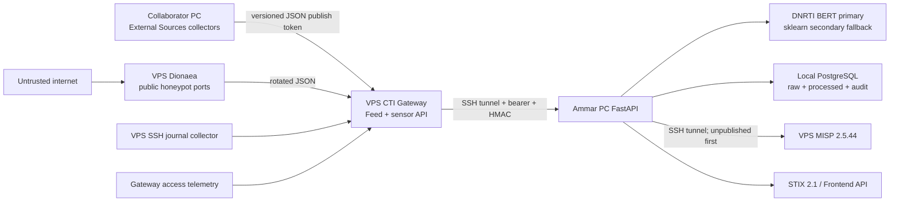

# Implemented Hybrid Cloud Backend Architecture

## Current decision

The graduation project uses a cost-aware hybrid architecture. Heavy ML and the central database remain on Ammar's computer; internet-facing collection and CTI sharing run on the VPS; External Sources collection remains owned by the collaborator.



## Component ownership

| Component | Location | Role |
|---|---|---|
| External collectors | Collaborator PC | Collect, preprocess, privacy-filter, deduplicate within External scope, export versioned JSON |
| CTI Gateway | VPS loopback | Accept scoped publish, serve authenticated/HMAC feed and sensor pages, log safe web metadata |
| Dionaea | VPS public sensor network | Capture selected hostile service interactions into JSON; no backend/MISP secret |
| SSH journal collector | VPS host | Convert accepted/failed SSH authentication metadata into bounded JSONL without passwords |
| FastAPI backend | Ammar PC | Validate, normalize, sessionize, extract, score, correlate, audit, expose APIs |
| PostgreSQL | Ammar PC private Compose network | Central source of truth for raw and processed project data |
| DNRTI models | Ammar PC | `dnrti_bert_ner` primary; `dnrti_sklearn_ner` secondary fallback |
| MISP | VPS loopback | Unpublished sharing/review copy; not the application database |

## External flow

```text
External collectors
-> versioned JSON
-> publish-only Gateway token
-> privacy and structural validation
-> ETag/HMAC authenticated backend pull
-> raw_items
-> relevance classification
-> BERT NER + Regex IoCs + prototype relationships
-> unified threat_events
-> correlations/risk/STIX/MISP/API
```

The Gateway removes metadata keys containing token, secret, password, authorization, cookie, or API-key semantics before storing the exchange artifact. A repeated unchanged pull is answered with HTTP 304 and produces a completed zero-record pipeline run.

## Internal flow

```text
Dionaea JSON / SSH auth JSON / Gateway web JSON
-> authenticated HMAC sensor endpoint
-> raw_items
-> 30-minute sessions
-> numeric session features
-> Isolation Forest (or labelled small-batch fallback)
-> retain all sessions
-> promote outlier sessions only to threat_events
```

The current acceptance database retained 57 sessions: 7 promoted outliers and 50 non-threat sessions. This proves the backend does not treat every log line as a threat.

## MISP flow

The backend maps CTI indicators to MISP types, creates a deterministic event UUID, keeps `published=false`, adds each missing attribute, reads the event back, and fails the API call if any requested indicator is absent. Time bounds are normalized so `first_seen <= last_seen`. A repeated send finds the existing event and adds zero attributes.

PostgreSQL remains authoritative. MISP contains a controlled sharing copy and future analyst-approved publications.

## Trust and network boundaries

### Personal computers to VPS

- SSH key authentication only; password and keyboard-interactive login are disabled.
- Gateway and MISP are bound to VPS loopback and reached through local SSH forwarding.
- Read and publish tokens are separate; the collaborator does not receive sensor-read or MISP credentials.
- Client secret fragments are ignored by Git.

### Honeypot boundary

- Dionaea has no Docker socket, host filesystem, MISP key, PostgreSQL credential, or personal-LAN route.
- Separate Docker networks use fixed subnets and inter-container communication is disabled.
- `DOCKER-USER` permits established replies and drops new outbound connections from sensor/gateway subnets.
- Public ports are selected honeypot ports only.

Containers still share the VPS kernel. This is acceptable for the cost-constrained graduation lab but is not equivalent to a separate physical honeypot host. A second disposable VPS remains recommended future work.

## Wazuh decision

Wazuh Manager/Indexer/Dashboard are not deployed. On a 12 GB server, MISP plus the Gateway and public sensor provide more project value with lower operational risk. The existing Wazuh file/Indexer connector remains tested optional code and historical Wazuh sample rows remain clearly distinguishable from live VPS sources.

## Validation boundary

Live acceptance currently covers:

- hardened SSH and host firewall;
- healthy Gateway, Dionaea, MISP Core, MariaDB, Valkey/Redis, and MISP Modules;
- live External publish/pull and HTTP 304 repeat;
- live Dionaea, SSH-auth, and web sensor pulls;
- PostgreSQL raw/processed separation and outlier-only promotion;
- BERT runtime and saved held-out metrics;
- correlation and STIX export;
- unpublished, verified, idempotent MISP delivery.

It does not claim high availability, production PKI/domain exposure, a separate honeypot kernel, off-host restore proof, Wazuh deployment, live Onion collection, or enterprise SOC scale.
