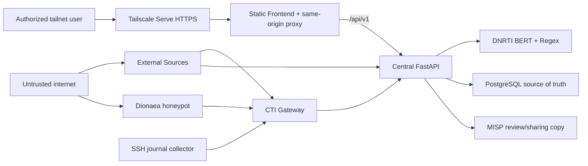

# Implemented VPS-Only CTI Architecture

## Current decision

The graduation platform has one production runtime: the VPS. A personal or
collaborator computer may be used for source review and emergency diagnostics,
but it does not host FastAPI, PostgreSQL, DNRTI models, collectors, or the
frontend.

The design follows the processing lifecycle in *AI-Based Holistic Framework for
Cyber Threat Intelligence Management*: gather internal and external evidence,
apply privacy and relevance controls, extract IoCs/IoAs and entities, correlate,
store centrally, and share selected intelligence through MISP. It also adopts
the useful OpenCTI connector boundary: collectors produce a versioned handoff;
only the central platform writes authoritative CTI state. OpenCTI itself,
Elasticsearch, RabbitMQ, MinIO, TheHive, Cortex, and Wazuh are not deployed.



## Service and trust boundaries

| Component | Role | Network boundary |
|---|---|---|
| Frontend | Static analyst UI and `/api/v1` reverse proxy | Loopback host port plus `frontend_backend` with Backend only |
| Central Backend | Authentication, orchestration, validation, analysis, correlation, risk, STIX, MISP delivery | Loopback diagnostics and explicit pairwise networks |
| PostgreSQL | Authoritative raw and processed CTI state | Compose-private; no published port |
| External Sources | Collection, privacy, relevance, External-only deduplication, versioned export | Egress plus `cti-backend-external` with Backend only |
| CTI Gateway | Bounded cumulative feed and sensor delivery using tokens, HMAC, pagination, checkpoints, ETag and GZip | `cti-backend-gateway` with Backend only |
| MISP Core | Unpublished review/sharing copy; never the central database | Loopback HTTPS plus `cti-backend-misp` with Backend only |
| Dionaea | Public honeypot evidence | Isolated sensor network; no Backend, database, or MISP secret |

All end-user traffic enters through the Frontend. The browser never receives a
Gateway, External Control, sensor, MISP, or PostgreSQL credential.

## External processing flow

```text
bounded collection
-> privacy and structural validation
-> relevance classification
-> versioned run export
-> cumulative stable-identity Gateway snapshot
-> authenticated HMAC pull
-> database unchanged-record filter
-> DNRTI BERT + Regex + relationship extraction
-> correlation/risk/STIX
-> PostgreSQL
-> optional unpublished MISP delivery
```

The Gateway is a delivery boundary, not a second CTI database. A repeated
snapshot uses ETag/HTTP 304 and must create a completed zero-processing run.
Changed snapshots send only new or semantically changed records to BERT.

This is conceptually similar to OpenCTI's external-import connectors producing
STIX bundles for platform workers, but the graduation project retains its own
versioned JSON handoff and PostgreSQL schema. Introducing a broker is deferred
until measured concurrency requires an asynchronous Analysis Worker.

## Internal processing flow

```text
Dionaea JSON / SSH authentication JSON / Gateway web JSON
-> authenticated HMAC sensor pages
-> raw_items
-> sessions and numeric features
-> outlier decision
-> promote outliers only
-> threat_events / indicators / entities / relationships
```

Wazuh is intentionally disabled. Its connector remains tested optional code and
historical sample data must remain distinguishable from live VPS evidence.

## MISP flow

Backend and MISP Core share only the internal `cti-backend-misp` network.
Backend calls `http://cti-misp` with `MISP_ALLOW_HTTP=true`; the client rejects
all other non-loopback HTTP hosts. This avoids incorrectly trusting MISP's
localhost-only origin certificate while keeping the hop inside one isolated
same-host bridge. Tailnet operators still use Tailscale HTTPS.

MISP delivery uses deterministic event and attribute UUIDs, defaults to
`published=false`, inserts only missing attributes, reads the event back, and
fails if requested indicators are absent. PostgreSQL remains authoritative.

## NER runtime decision

DNRTI BERT remains in the Central Backend for the current load. The model is a
read-only external artifact mounted into the container and loaded once per
process. It becomes a separate Analysis Worker only after measurements show API
contention. That future boundary requires a durable job contract, idempotency,
bounded retries, queue depth monitoring, and single-writer central persistence.

## Private access and recovery

- Tailscale Serve HTTPS is the normal operator path; Funnel remains disabled.
- Backend, Frontend, Gateway, External Control, MISP, and PostgreSQL have no
  public application ports.
- Selected Dionaea honeypot ports and SSH are the only intended public ingress.
- SSH local forwarding remains diagnostic fallback and never hosts Backend or
  PostgreSQL on an operator computer.
- Runtime secrets are root-only under `/etc/cti-platform` and
  `/opt/cti-platform/clients`; they are never committed.

## Acceptance boundary

A release is accepted only after verified PostgreSQL backup, healthy containers,
authenticated login and `/auth/me`, dashboard/source rendering, all configured
integration health checks, BERT inference, an unchanged External Feed pull with
zero processing, MISP read health, reboot persistence, and a recorded
application rollback checkpoint.

## Primary references

- A. Spyros et al., *AI-Based Holistic Framework for Cyber Threat Intelligence Management*, IEEE Access, DOI `10.1109/ACCESS.2025.3533084`.
- OpenCTI platform: <https://github.com/OpenCTI-Platform/opencti>
- OpenCTI connector architecture: <https://github.com/OpenCTI-Platform/opencti/blob/master/docs/docs/deployment/connectors.md>
