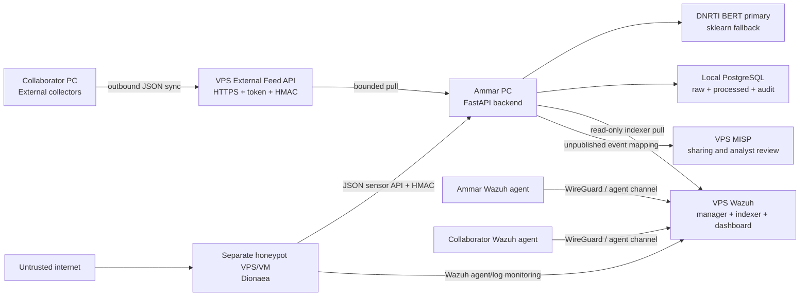

# Distributed Cloud Backend Architecture

## Decision

The project uses a hybrid design:

- The collaborator's computer performs external collection and produces versioned JSON.
- The VPS hosts the authenticated external feed service and shared security platforms.
- Ammar's computer runs the central FastAPI backend, PostgreSQL, BERT-first analysis, correlations, scoring, and final CTI API.
- Wazuh and MISP are integrations, not replacements for the central CTI database.
- A public honeypot is a hostile boundary and should use a separate disposable VPS/VM from MISP and Wazuh.



## Trust boundaries

### Boundary 1: external collector to feed API

The collaborator does not send Python objects or database access. The hand-off is the versioned JSON contract in `docs/api/external_feed_contract.md`. The backend validates HTTPS policy, authentication, response size, pagination, schema version, stable identifiers, feed identity, timestamps, and optional HMAC before any batch is persisted.

### Boundary 2: VPS to central backend

The backend initiates outbound pulls. Wazuh Indexer TCP `9200` and the Dionaea sensor API should be reachable only through WireGuard/private addressing. The backend stores only non-secret checkpoints/ETags in `sources.config`; credentials stay in environment variables.

### Boundary 3: public honeypot

Anything exposed by Dionaea is assumed compromise-prone. The honeypot must have no Docker socket, shared volume, database credential, MISP key, Wazuh Indexer credential, or route to Ammar's LAN. It sends evidence outward using narrowly scoped credentials. MISP and Wazuh must not share its Docker network.

If budget forces all services onto one physical VPS, containers still share one kernel; Docker networks are not the same as a separate security boundary. That layout is accepted only as a temporary graduation demonstration with explicit residual risk, strict firewalling, separate Linux users/projects/secrets, no cross-mounted volumes, controlled egress, and tested backups.

## Runtime flows

### External CTI

```text
Collaborator collectors
-> versioned JSON feed
-> HTTPS/HMAC contract validation
-> raw_items
-> relevance classification
-> BERT NER (sklearn fallback)
-> Regex IoCs + prototype relationships
-> unified threat_events
-> correlation/NVD/risk
-> API, STIX, optional MISP
```

### Wazuh

```text
Wazuh agents
-> Wazuh Manager rules/decoders
-> wazuh-alerts* index
-> read-only authenticated Indexer API pull
-> checkpointed search_after pagination
-> raw_items
-> sessions/features/Isolation Forest
-> outlier CTI events only
```

### Dionaea

```text
Internet interaction
-> Dionaea JSON log
-> A: private JSON sensor API -> raw Dionaea backend pipeline
-> B: Wazuh agent -> Wazuh alerts -> Wazuh backend pipeline
```

Paths A and B are intentionally complementary. Path A preserves raw honeypot evidence; path B adds SIEM decoding, rules, monitoring, and dashboards.

## Resource decision recorded on 2026-08-24

Contabo's current portfolio lists Cloud VPS 4 as 4 vCores, 8 GB RAM, and 100 GB SSD. Wazuh's current official single-node Docker minimum alone is 4 cores, 8 GB RAM, and 50 GB storage. Therefore Cloud VPS 4 is not a credible host for Wazuh plus MISP plus a public honeypot. For a combined Wazuh/MISP graduation server, Cloud VPS 8 (currently 8 vCores, 24 GB RAM, 300 GB SSD) is the practical starting tier; the honeypot should still be separate. Sources: [Contabo server portfolio](https://help.contabo.com/en/support/solutions/articles/103000408463-can-i-get-more-information-about-contabo-s-server-portfolio-), [Wazuh Docker requirements](https://documentation.wazuh.com/current/deployment-options/docker/wazuh-container.html).

This is capacity planning, not a guarantee. Retention, Wazuh index growth, MISP modules, and attack volume must be measured after deployment.

## Data ownership

- PostgreSQL is the central source of truth for this project's raw records, normalized CTI, entities, indicators, relationships, correlations, sessions, runs, users, and audit logs.
- Wazuh Indexer owns SIEM alerts and agent/security telemetry.
- MISP owns shared/published intelligence and analyst collaboration copies.
- The feed service owns only the collaborator's exchange JSON and cursor state.
- The honeypot owns rotated sensor logs until collected and retained according to policy.

## Completion definition

Local clients and contracts are implemented. Cloud deployment becomes complete only after SSH deployment, certificates, firewall/VPN policy, real health checks, one real external pull, one Wazuh agent alert, one Dionaea interaction, one raw sensor pull, one unpublished MISP send, backup/restore evidence, and recorded negative tests all pass.
